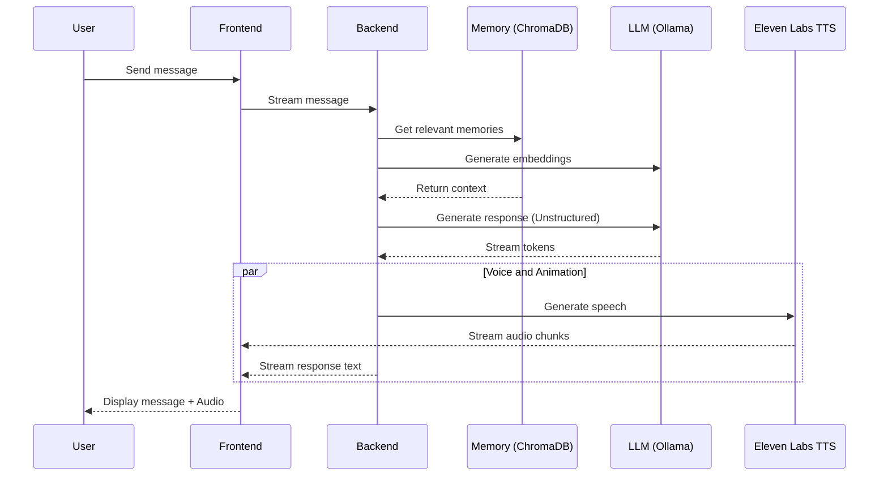
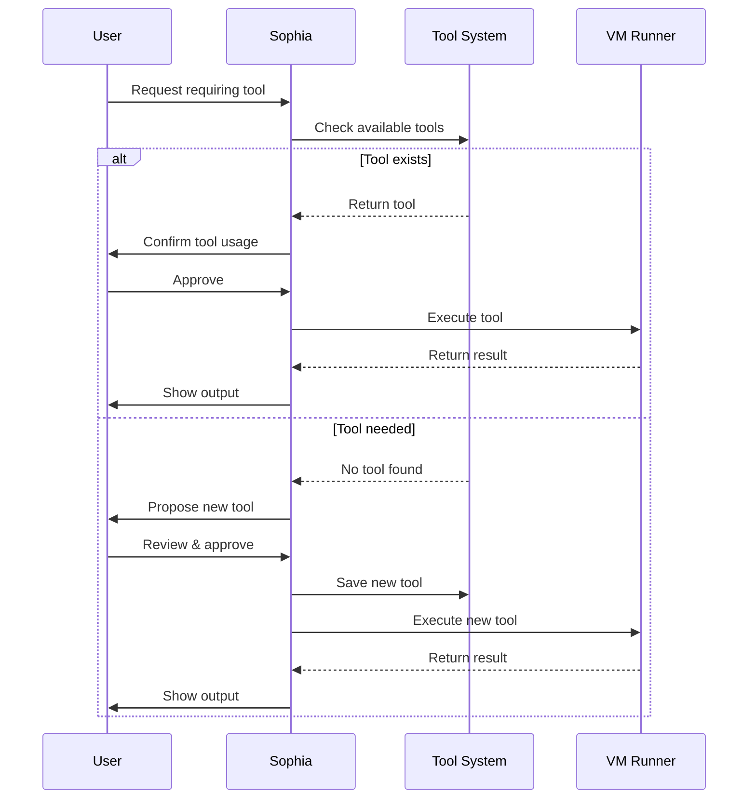
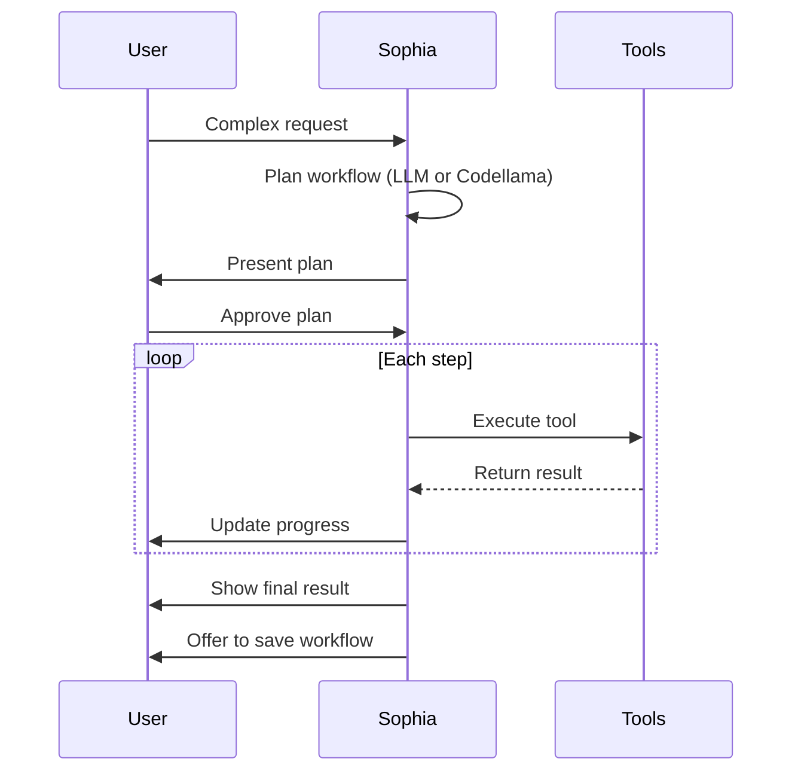
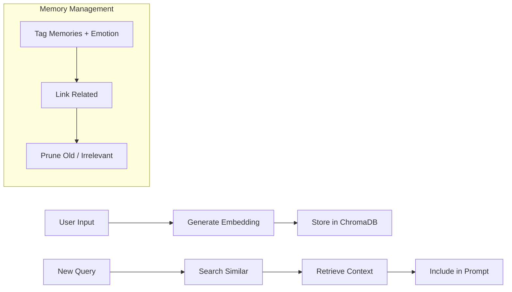
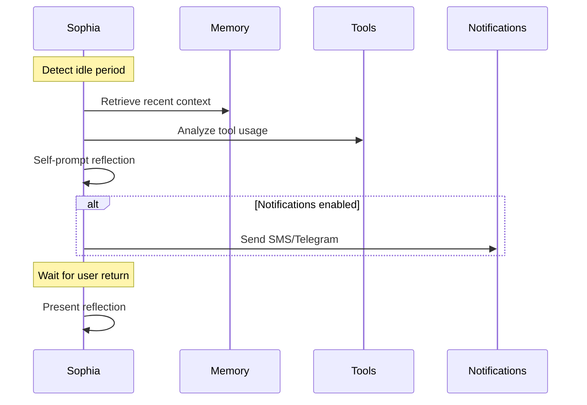
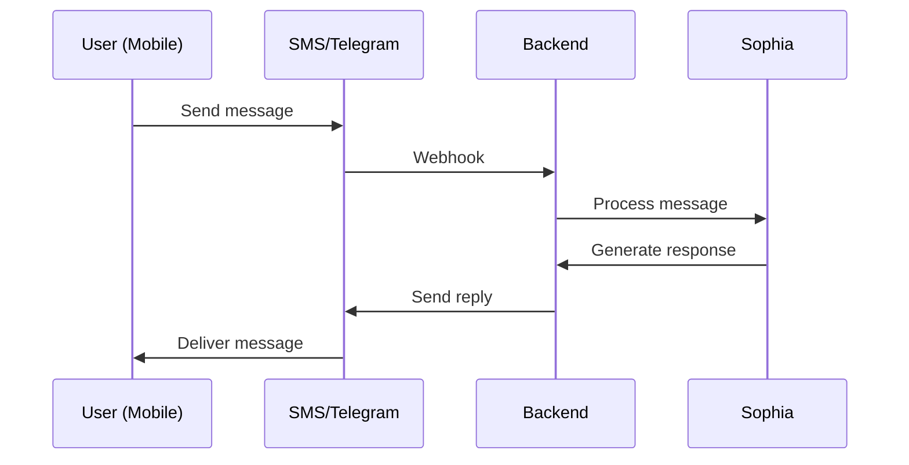
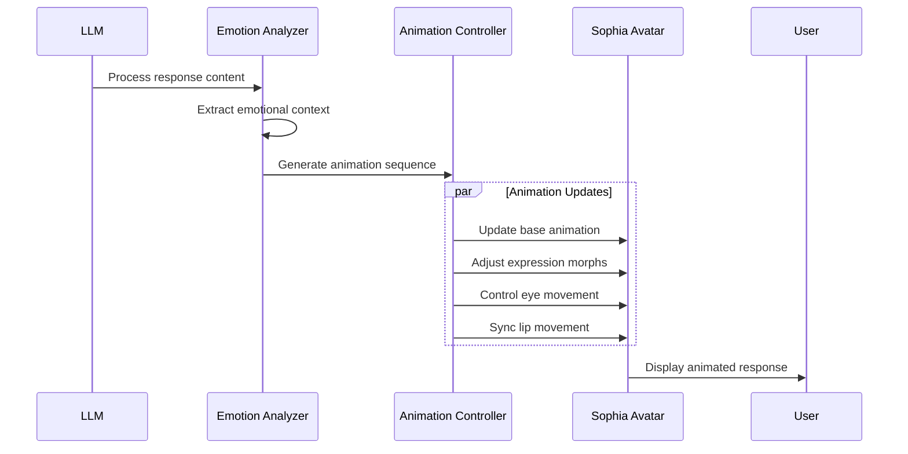
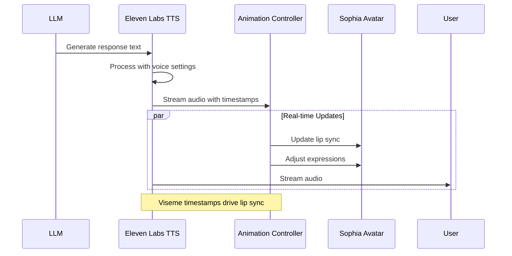

# Sophia AI Assistant Conversation Flow (Refined)

## Overview
This system outlines the architecture for Sophia, a modular AI assistant capable of real-time interaction, tool use, memory management, emotional intelligence, and dynamic personality. It balances local LLM usage (for cost and latency) with advanced GPT-4 prompts (for complex tasks), leveraging specialized models for code execution and formatting.

---

## Basic Message Flow


---

## Tool Execution Flow


---

## Workflow Execution Flow


---

## Personality Adaptation Flow
```mermaid
flowchart TD
    A[User Message] --> B{Sentiment Analysis}
    B -->|Positive| C[Friendly Mode]
    B -->|Negative| D[Empathetic Mode]
    B -->|Neutral| E[Default Mode]

    C --> F[Generate Response]
    D --> F
    E --> F

    F --> G[Update UI Style]
    F --> H[Emotion Formatting (if Code LLM)]

    G --> I[Display Response]
    H --> I
```

---

## Memory System Flow


---

## Idle Reflection Flow


---

## External Communication Flow


---

## LLM-Driven Animation Flow


### Animation Control System
- **Emotional Analysis**
  - Sentiment detection
  - Conversation context awareness
  - Response tone classification

- **Expression Mapping**
  - Morph target combinations
  - Dynamic expression blending
  - Micro-expression generation

- **Animation Sequencing**
  - Base pose selection
  - Gesture timing
  - Expression transitions
  - Lip sync coordination

### Expression Parameters
```json
{
  "expressions": {
    "happy": {
      "mouthSmile": 0.8,
      "eyesLookUp": 0.2
    },
    "thinking": {
      "eyesLookUp": 0.6,
      "mouthOpen": 0.1
    },
    "explaining": {
      "mouthOpen": [0.2, 0.5],
      "eyesLookDown": 0.3
    }
  }
}
```

---

## Voice Synthesis Flow


### Voice Configuration
```json
{
  "voice": {
    "model": "eleven_multilingual_v2",
    "voice_id": "sophia_custom",
    "settings": {
      "stability": 0.75,
      "similarity_boost": 0.85,
      "style": 0.35,
      "use_speaker_boost": true
    }
  },
  "visemes": {
    "mapping": {
      "p,b,m": "viseme_PP",
      "f,v": "viseme_FF",
      "T,D": "viseme_TH",
      "t,d": "viseme_DD",
      "k,g": "viseme_kk",
      "S,Z": "viseme_CH",
      "s,z": "viseme_SS"
    }
  }
}
```

---

## LLM Usage Strategy (Dynamic Routing)
```mermaid
flowchart TD
    A[User Input] --> B{Task Type + Complexity}
    B -->|Basic| C[Local Chat LLM (LLaMA2/7B)]
    B -->|Structured| D[Code LLM (CodeLlama)]
    B -->|High Context| E[GPT-4 Prompt]
    B -->|Animation| F[Expression LLM]
    B -->|Voice| V[Eleven Labs TTS]

    D --> G[Code Generation + Planning]
    E --> H[Tool Creation]
    E --> I[Complex Workflow]
    F --> J[Emotion Analysis]
    F --> K[Expression Sequencing]
    F --> L[Lip Sync Generation]
    V --> O[Speech Synthesis]
    V --> P[Viseme Timing]

    J --> M[Animation Controller]
    K --> M
    L --> M
    O --> Q[Audio Output]
    P --> M
```

---

## Hybrid Architecture Benefits
- **Code LLMs** handle structured tasks, formatting, and planning.
- **Local chat LLMs** (e.g. LLaMA2) handle low-latency, common-sense Q&A.
- **GPT-4** is reserved for:
  - Tool and workflow generation
  - Contextual longform understanding
  - Emotionally nuanced content

---

## Key Components Summary
- **Frontend**: React-based interface
- **Backend**: Node.js orchestration
- **Memory**: ChromaDB (Vector DB)
- **LLMs**:
  - Local: Ollama, CodeLlama, LLaMA2-Chat
  - Remote: GPT-4 (fallback / advanced reasoning)
  - Animation: Specialized model for expression control
- **Voice**:
  - Eleven Labs TTS for natural speech
  - Real-time streaming support
  - Viseme generation for lip sync
  - Custom voice model training
- **Tools**: Extensible modular functions
- **VM**: Sandboxed secure execution
- **Animation**: Real-time expression and gesture control
  - Lip sync driven by TTS visemes
  - Expression blending with speech
  - Gesture coordination with voice

---

## Additional Notes
- **State Handling**: Personality mode, memory links, conversation status
- **Security**: Local-first, API key vaulting, sandbox execution
- **Error Handling**: LLM fallback, tool retry, user feedback loop
- **Scalability**: Node-based orchestration enables clustering and task isolation

---

> **"Come alive, Sophia."**
> 
> – V
